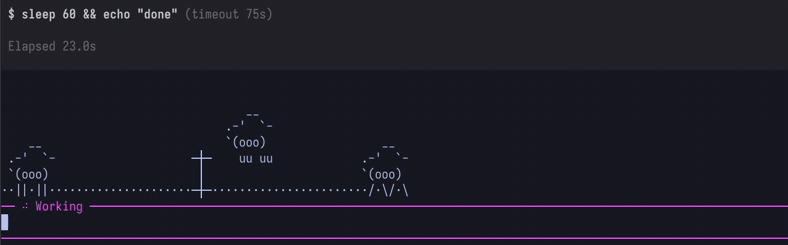

# pi-sheep



Counting sheep for [pi](https://pi.dev): while a bash `sleep` tool call runs,
a widget above the editor shows three ASCII sheep on a dotted field. A fence
sweeps past and each sheep hops it with a little jump arc.

- One extension file, no dependencies.
- Triggers on `sleep` / `usleep` bash tool calls, handles parallel sleeps,
  ignores non-tui modes, cleans up on session shutdown.
- Runs standalone as a preview: `bun sheep.ts` (Ctrl+C to stop).

## Install

```bash
pi install git:github.com/Simar-malhotra09/pi-sheep@v1.0.0
```

Then run `/reload` in pi and ask the agent to run `sleep 10`.

## Test

```bash
bun test-sheep.ts
```
